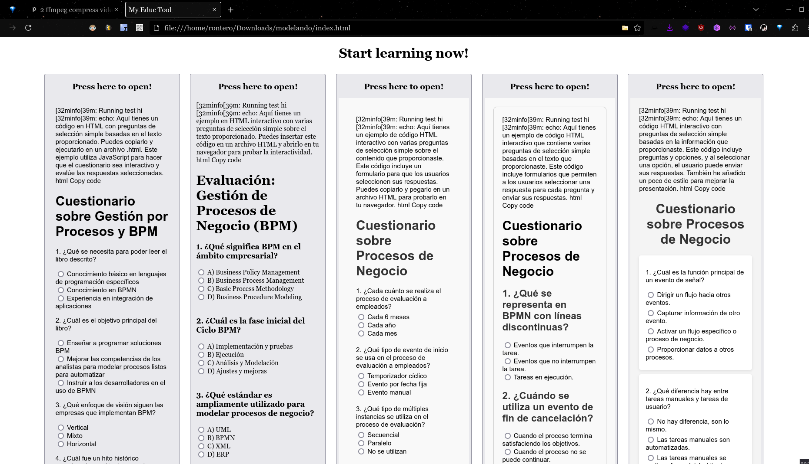
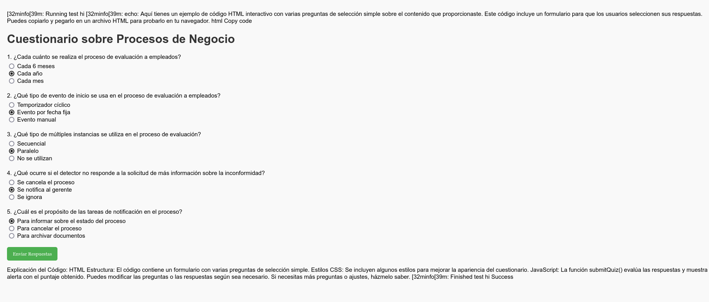
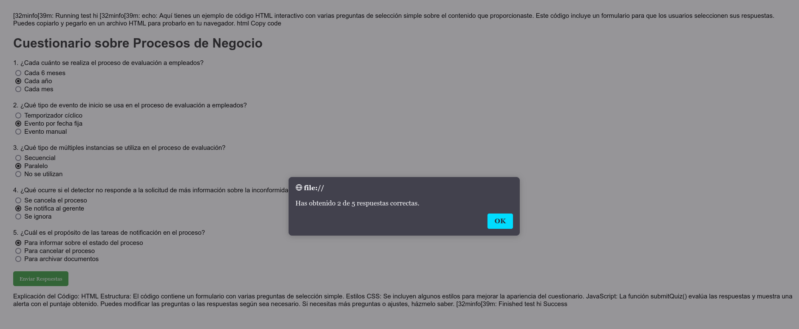

# UNIE Stuff Tools

### PDF Scraper

Will probably add:

- Select different profiles of firefox
- Specify the pages by input
- Optimize the selenium script to run all of the requests in one task
    - (Optional) Maybe just make it so it doesn't close the browser sadge
- Install dependencies if you don't have any of them
- Extra summaries as info panels, and the whole chunk from where it came from
- Show total time taken
- Make it a hidden task, and pretty loading bar
- Output a folder with the books name
- Adjust response speed depending on the response time of the last request

---

# PDF Scrapper: Kit de Generacion

*Autor: Ricardo Montserrat*

### Explicacion
---

He escrito un pequeño script el cual automatiza la creacion del kit.


> Para probar el sitio web, puedes abrir con doble click el index.html dentro de las carpetas
> del sitio web de cada libro

### Como Funciona
---

El script se encarga de extraer todo el contenido del pdf a texto,
y luego separa este texto en paquetes de 200 lineas cada uno como maximo.

```bash
pageSize=200 # lines

pdftotext -raw -enc 'UTF-8' -f $startPage -l $endPage "$pdf" "$outDir/$outFile.txt"

split -l "$pageSize" --numeric-suffixes "$outDir/$outFile.txt" "$outDir/page"
```

Para asi luego enviarlo como contexto justo al prompt que escribe el usuario del script.

```json
{
    ...
    "value": "${content}\n\n${query}"
}
```
Al decirle en el prompt que genere el output como codigo html, al final puedo
parsear todos los resultados de cada una de las respuestas de gpt,
y asi generar un web interactiva con la cual puedes responder a preguntas
resumidas sobre todo el pdf.

```php
foreach (glob("output/*.html") as $filename) {
    echo "
    <button>
        <h2> Press here to open! </h2>
        <embed type='text/html' src='$filename'>
    </button>\n
    ";
}
```

```bash
php index.php > index.html && open index.html
```



### Datos Necesarios
---

**Prompt:** "Dame en codigo de html varias preguntas de seleccion simple sobre lo anterior"

**Libro_Gestion_de_Procesos.pdf**
- Paginas 331 / desde la 11 hasta la 139
> Los 5 capitulos enteros

**Modelando el negocio con BPM en - Juan Carlos Gras.pdf**
- Paginas 142 / desde la 10 hasta 139
> Saltamos indice y prologo


### Conclusion
---

Los resultados son facilmente interpretables como verdaderos en todos los casos,
ya que se utiliza como contexto en cada prompt, la informacion sobre la que se requiere
la informacion para GPT.




### Referencias
---

**Link a todo el codigo:** https://github.com/Ronterox/UNIE

**Link a video del funcionamiento del bot:** https://streamable.com/bwab4q
